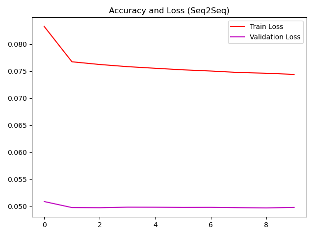

# Automatic Text Summarization

## Intro

Abstractive Summarization is a method, which aims to automatically generate summaries of documents through the extraction of sentences in the text. The specific model we implemented based on 'The Daily Mail' dataset of stories, taking each and generating summary. The architecture of this method consists of a encoder-decoder design using LSTM layers.

## Data Preprocessing

The file ```data_util``` responsible for reorganizing the files into more python like data structures, then in ```utils.py``` we have the preprocessing method that vectorizing and divideing our data into train and val


First install required dependencies:

```bash
pip install -r requirements.txt
```

# EncoderDecoder Model

## Training

The file ```utils``` contains the essential function to perform preprocessing and running the layers to predict a sentence``

to run both train and eval you can use the command:
```bash
python main.py
```

## Results


**Ouput model loss**

```bash
Loaded Stories 250
Train input size 175
Test input size 75

Train
Number of unique input tokens: 5613
Number of unique output tokens: 678

Epoch 1/25
3/3 [==============================] - 9s 3s/step - loss: 1.6426 - val_loss: 1.9482
Epoch 2/25
3/3 [==============================] - 9s 3s/step - loss: 1.6379 - val_loss: 1.9495
Epoch 3/25
3/3 [==============================] - 9s 3s/step - loss: 1.6329 - val_loss: 1.9631
Epoch 4/25
3/3 [==============================] - 9s 3s/step - loss: 1.6130 - val_loss: 2.1303
Epoch 5/25
3/3 [==============================] - 9s 3s/step - loss: 1.5702 - val_loss: 2.2681
Epoch 6/25
3/3 [==============================] - 9s 3s/step - loss: 1.5316 - val_loss: 2.4084
Epoch 7/25
3/3 [==============================] - 9s 3s/step - loss: 1.4977 - val_loss: 2.5793
Epoch 8/25
3/3 [==============================] - 9s 3s/step - loss: 1.4648 - val_loss: 2.7414
Epoch 9/25
3/3 [==============================] - 9s 3s/step - loss: 1.4324 - val_loss: 2.8845
Epoch 10/25
3/3 [==============================] - 9s 3s/step - loss: 1.4033 - val_loss: 3.0378
Epoch 11/25
3/3 [==============================] - 9s 3s/step - loss: 1.3766 - val_loss: 3.1628
Epoch 12/25
3/3 [==============================] - 9s 3s/step - loss: 1.3491 - val_loss: 3.2501
Epoch 13/25
3/3 [==============================] - 10s 3s/step - loss: 1.3261 - val_loss: 3.3194
Epoch 14/25
3/3 [==============================] - 9s 3s/step - loss: 1.3101 - val_loss: 3.3772
Epoch 15/25
3/3 [==============================] - 9s 3s/step - loss: 1.2884 - val_loss: 3.4208
Epoch 16/25
3/3 [==============================] - 11s 4s/step - loss: 1.2742 - val_loss: 3.4442
Epoch 17/25
3/3 [==============================] - 10s 3s/step - loss: 1.2610 - val_loss: 3.4650
Epoch 18/25
3/3 [==============================] - 9s 3s/step - loss: 1.2436 - val_loss: 3.4949
Epoch 19/25
3/3 [==============================] - 10s 3s/step - loss: 1.2307 - val_loss: 3.5108
Epoch 20/25
3/3 [==============================] - 9s 3s/step - loss: 1.2206 - val_loss: 3.5259
Epoch 21/25
3/3 [==============================] - 9s 3s/step - loss: 1.2070 - val_loss: 3.5378
Epoch 22/25
3/3 [==============================] - 9s 3s/step - loss: 1.1935 - val_loss: 3.5438
Epoch 23/25
3/3 [==============================] - 9s 3s/step - loss: 1.1865 - val_loss: 3.5399
Epoch 24/25
3/3 [==============================] - 8s 3s/step - loss: 1.1783 - val_loss: 3.5414
Epoch 25/25
3/3 [==============================] - 8s 3s/step - loss: 1.1719 - val_loss: 3.5375
```

```json
{
    "rouge-1": {
        "f": 0.054421289314752465,
        "p": 0.4231884057971014,
        "r": 0.02974606795512569
    },
    "rouge-2": {
        "f": 0.0028187238995702316,
        "p": 0.03259259259259259,
        "r": 0.001495800983364506
    },
    "rouge-l": {
        "f": 0.08334677411153489,
        "p": 0.3751937984496124,
        "r": 0.04805841277828462
    }
}
```

|       Model        | ROUGE-1 | ROUGE-2 | ROUGE-l |
| ------------------ | :-----: | ------: | ------: |
| Our Implementation | 42.31%  |   3.25% |  37.51% |
| Random Baseline    | 32.14%  |  11.39% |  22.11% |


# Seq2Seq Model


## Training

The file ```utils``` contains the essential function to perform preprocessing and running the layers to predict a sentence``

```bash
python -m seq2seq.train
```

## Results

To first evaluate sum of the stories using the saved model we can run

```bash
python -m seq2seq.eval
```


**Ouput model loss**

```bash
demo size:  350
testing size:  150
start fitting ...
(1361,)
(583,)
(12562, 115)
(5371, 115)
Epoch 1/10
196/196 [==============================] - 109s 557ms/step - loss: 0.1562 - accuracy: 0.0023 - val_loss: 0.1111 - val_accuracy: 0.0024
Epoch 2/10
196/196 [==============================] - 108s 550ms/step - loss: 0.1409 - accuracy: 0.0027 - val_loss: 0.1084 - val_accuracy: 0.0028
Epoch 3/10
196/196 [==============================] - 109s 555ms/step - loss: 0.1397 - accuracy: 0.0028 - val_loss: 0.1079 - val_accuracy: 0.0028
Epoch 4/10
196/196 [==============================] - 110s 560ms/step - loss: 0.1389 - accuracy: 0.0028 - val_loss: 0.1076 - val_accuracy: 0.0028
Epoch 5/10
196/196 [==============================] - 109s 559ms/step - loss: 0.1383 - accuracy: 0.0028 - val_loss: 0.1075 - val_accuracy: 0.0028
Epoch 6/10
196/196 [==============================] - 108s 549ms/step - loss: 0.1379 - accuracy: 0.0028 - val_loss: 0.1074 - val_accuracy: 0.0028
Epoch 7/10
196/196 [==============================] - 113s 575ms/step - loss: 0.1374 - accuracy: 0.0028 - val_loss: 0.1074 - val_accuracy: 0.0028
Epoch 8/10
196/196 [==============================] - 114s 581ms/step - loss: 0.1370 - accuracy: 0.0028 - val_loss: 0.1073 - val_accuracy: 0.0028
Epoch 9/10
196/196 [==============================] - 114s 582ms/step - loss: 0.1365 - accuracy: 0.0028 - val_loss: 0.1072 - val_accuracy: 0.0028

```




# Example Summaries


__Original text:__

Input text:  andy schleck, the 2010 winner, is out of the tour de france following a crash involving a spectator on monday's third stage from cambridge to london.schleck (trek factory racing) announced he would not be starting the 163.5-kilometre fourth stage from le touquet-paris-plage to lille.he wrote on twitter: 'very disappointed to let you know that i will not be able to start.down and out: schleck suffered a heavy fall a le tour headed through epping forest on mondaybad moment: luxembourg's andy schleck has been ruled out of the tour with a ligament injurycollision: a pedestrian taking photos was knocked over during stage 3 
of the tour de france on mondaymoment of impact: luxembourg's andy schleck collided with the pedestrian but managed to get to his feet'my knee is too damaged from the crash. this is a huge blow for me.'schleck is 
a shadow of the figure who duelled with alberto contador for the 2010 yellow jersey and inherited the title after the spaniard's win was quashed due to a doping violation.he was riding the tour in support of his brother frank, who is already more than a minute behind race leader vincenzo nibali.trek said schleck would travel to basle, switzerland, for further examination and possible surgery.schleck added in a team statement: 'i went on the rollers as soon as we arrived in le touquet, to get the muscles and tendons warmed up, but the pain is too much.'i believed until that moment that i would start. i think i ignored the pain somehow, hiding it in the back of my head.'i'm hugely disappointed. i was so happy to be here, racing with frank in the tour again.'i'm sad to let the team down, to let frank down. i was ready to help him defend his gc ambitions. i felt i was progressing, everything was coming back.'the crash occurred when, spotting a pedestrian stood virtually in the road, racers were forced to break suddenly and schleck fell from his bike.the 29-year-old managed to get back to his feet and finished the race but will now take no further part in the tour.raring to go: schleck in a training session prior to the start of the tour which he is unable to complete

__Summary generated:__

the 2010 winner will not take part from the fourth stage onwards

he said 'my knee is too damaged from the crash' on twitter

schleck was riding in support of his brother and said it was a 'huge blow'
